# daily_copy
##  Summary

There are two batch files, 'DailyCopyPer.bat' and 'DailyCopy.bat'.  'DailyCopyPer.bat' is personal version, you could download official software or nightly build software which you specified version. 'DailyCopy.bat' just for auto copy, it will copy the latest software of nightly build to the specified path. For example, today is February 19th, run 'DailyCopy.bat', and it will copy AIVI_NIGHTLY_S2STABI_2017_02_18_1 and AIVI_NIGHTLY_2017_02_18_1 to the specified path.

## Environment

Windows 7        
Nightly Build Server: \10.47.3x.xxx\ecm\CI1\CB\Nissan_IVI        
Official Build Server: \10.47.3x.xxx\ecm\CI1\Nissan\0042_RN_AIVI_7513750800\00_SW\IMX6        
## How to start

1.Start DailyCopyPer.bat

1.1. Edit 'DailyCopyPer.bat', and set the local path you'd like to get. For example, your local path is 'E:\stick'.
set CLIENT_PATH=ENTER_YOUR_PATH => set CLIENT_PATH=E:\stick

Note:        
The parameter '/MT[:N]' is for multi-thread. Creates multi-threaded copies with N threads. N must be an integer between 1 and 128. The default value for N is 16. You also change it to 8 if your computer runs slowly, e.g.

`set ROBOCOPY_OPTION=/E /ETA /COPY:DAT /MT:8`

1.2. Run 'DailyCopyPer.bat', you could see a simple menu:         
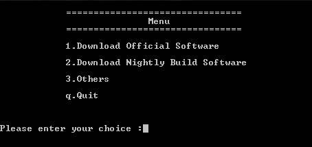

1.3. If you'd like to download nightly build software, please Select '2':                 
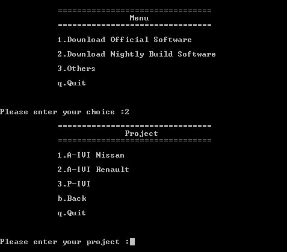

1.3.1. Choose your project, generally, nightly build for stabi branch just only include A-IVI Scope 2.0 Nissan project, but nightly build for feature branch include A-IVI Scope2.1 Nissan, A-IVI Scope2.1 Renault and P-IVI, so please choose a correct project.           
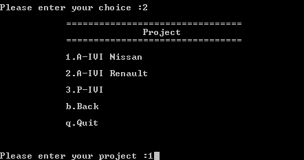

1.3.2. Then enter your version, ex: AIVI_NIGHTLY_S2STABI_2017_03_07_1                
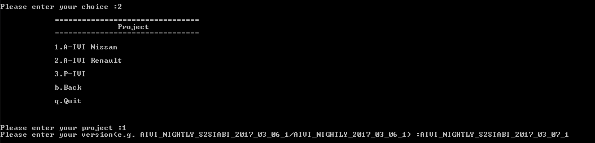

Script will download your version and show some information:              
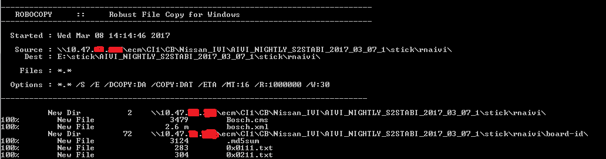

It will show result if download is finished.                
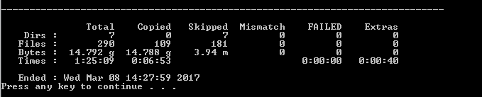

1.4. If you'd like to download official software, please select '1', and choose your project:           
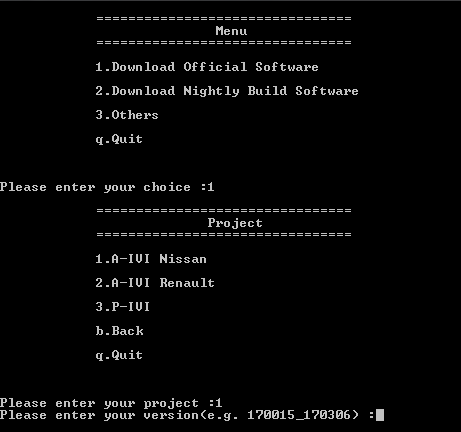

1.4.1. Enter your version, ex: 170015_170306. The version of official software could be found from release mail:                
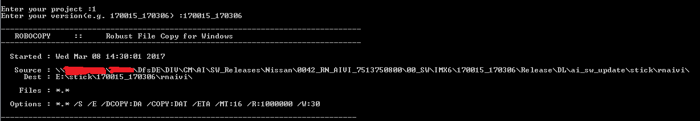

1.5. If you select '3'-Others, it will copy all files from your server to your client's path, but you must config 'YOUR_SERVER_PATH' and 'CLIENT_PATH'. e.g.:                        
`set YOUR_SERVER_PATH=ENTER_YOUR_PATH => set YOUR_SERVER_PATH=D:\NavRepoVS2013\script`                               
`set CLIENT_PATH=ENTER_YOUR_PATH => set CLIENT_PATH=D:\log\TEST`

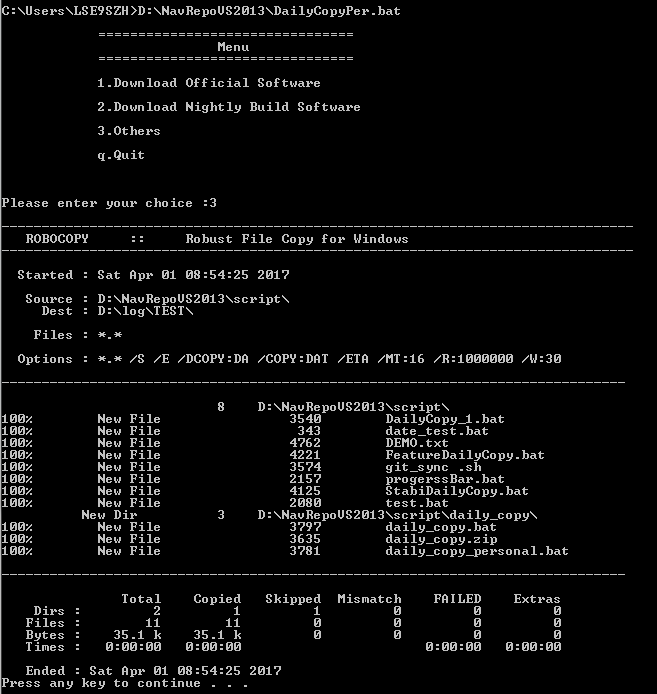

2.Start DailyCopy.bat
Currently, it will only download NISSAN and P-IVI SW for nightly build. Please adapt it if you have new requirement.

2.1. Edit 'DailyCopy.bat', and set the local path you'd like to get. For example, your local path is: E:\stick.           
`set CLIENT_PATH=ENTER_YOUR_PATH => set CLIENT_PATH=E:\stick`

If you'd like to copy SW to your path automatically, you could start 'schtasks' by windows command prompt.          
windows command prompt                      
`schtasks /create /tn TaskName /tr TaskRun /sc schedule /st StartTime`                  
EX:        
windows command prompt              
`schtasks /create /tn "DailyCopy" /tr D:\NavRepoVS2013\DailyCopy.bat /sc daily /st 08:00`                 
This command says, 'DailyCopy.bat' will be started at 08:00 every day, the task name is 'DailyCopy'.           

Note:                  
1.You must ensure that the date format is 'M/d/yyyy'              
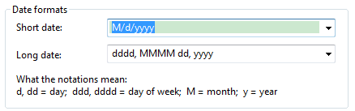

You could test by windows command prompt:                       
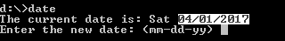

2.This script will store 10 softwares, so if your disk space is not big enough, you could do these changes:             
`set SW_NUM=10 => set SW_NUM=3`

It will only store 3 softwares.
